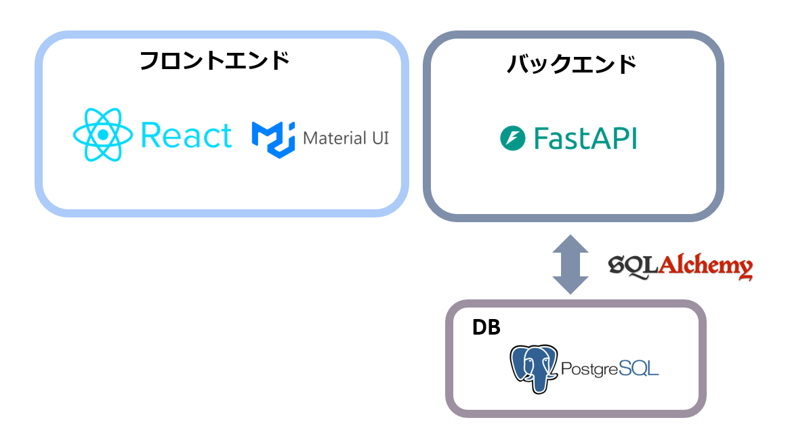

# 対話型ジャーナリング
対話形式でジャーナリング(内省)を支援し、ユーザの自己理解と感情の整理を促すアプリ

## 機能

- **対話形式のジャーナリング**   
  システムからの質問に答えるだけで、日々の出来事や感情を簡単に記録

- **感情可視化**  
  BERT による感情分析を用い、折れ線グラフでユーザーの感情推移を分かりやすく表示

- **対話記録の閲覧**  
  過去の対話記録を一覧で表示し、振り返りを容易にする
## コンセプト

- ジャーナリングは「何を書けばいいか」の心理的ハードルが高く、継続が難しい  
- 対話形式によって書き出しの敷居を下げ、習慣化を促進  
- 蓄積された記録を可視化し、心の変化を客観的に振り返る

## 開発環境
- React
- Typescript
- Python 3.10.12
- FastAPI

## システム構成図

  

